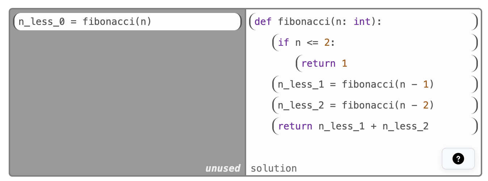
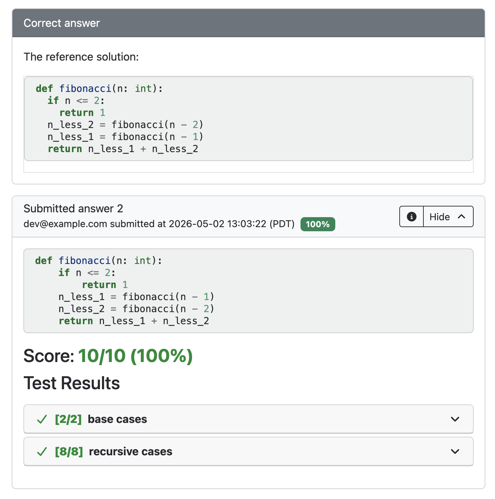
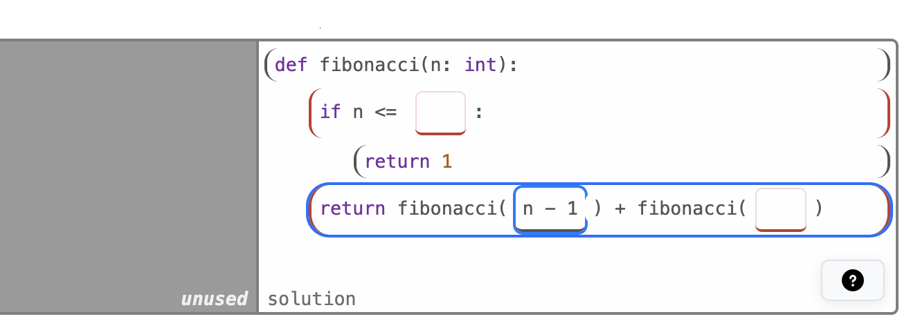
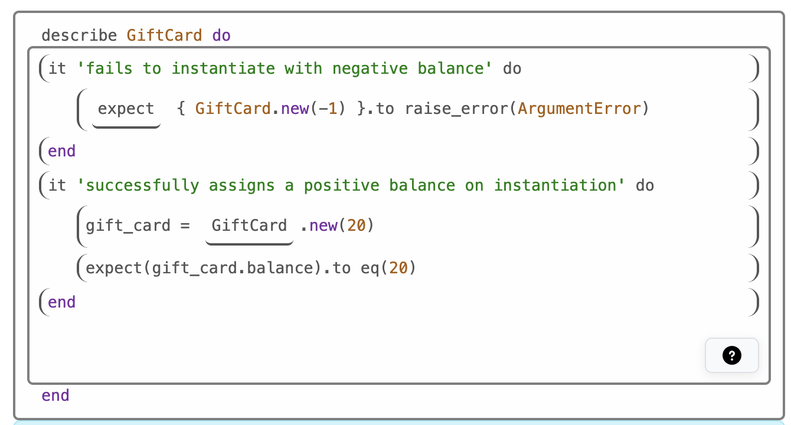
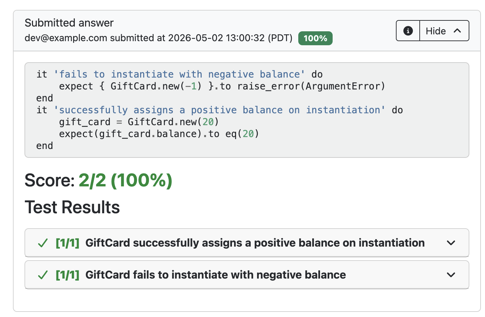

# PrairieLearn OER Element: Faded Parsons Problem

This element was developed by Nelson Lojo at UC Berkeley. Please carefully test the element and understand its features and limitations before deploying it in a course. It is provided as-is and not officially maintained by PrairieLearn, so we can only provide limited support for any issues you encounter!

If you like this element, you can use it in your own PrairieLearn course by copying the contents of the `elements` folder into your own course repository. After syncing, the element can be used as illustrated by the example question that is also contained in this repository.


## `pl-faded-parsons` element

This element creates a "faded" version of a Parsons Problem, where students drag and drop lines of code into order. In the faded version of the problem, students also fill in gaps in the code via embedded text inputs. This element is conceptually similar to `pl-order-blocks`, but adds support for faded code fragments and uses test-based grading (e.g., via the Python auto-grader) rather than comparing submissions to a sample solution. The latter can be beneficial when multiple correct solutions for a problem exist.

### Element Attributes

| Attribute | Type | Description |
|-----------|------|-------------|
| `answers-name` | string (required) | Unique name for the element. |
| `format` | string (default: `"right"`) | Format of the element. `"right"`/`"bottom"` for placement of the code canvas relative to the tray; `"one-tray"`` for one-tray format (see below). |
| `language` | string (default: `""`) | Code language, primarily used for syntax highlighting. |
| `file-name` | string (default: `"user_code.py"`) | Name for the code file submitted to the auto-grader. |
| `solution-path` | string (default: `"./solution"`) | Name of the solution code file displayed in the answer panel. If language is set to `"python"` and no valid path is provided, the path is automatically inferred as `"tests/ans.py"``. |
| `max-indent-level` | integer (default: `5`) | Maximum indentation level for student submissions. |
| `enable-copy-code` | boolean (default: `false`) | Whether a button should be displayed that allows students to copy their submission as plain text. |

### Examples

#### Standard Parsons Problem

```html
<pl-faded-parsons answers-name="fpp" language="python">
  def fibonacci(n: int): #0given
    if n <= 2: #1given
      return 1 #2given
    n_less_2 = fibonacci(n - 2)
    n_less_1 = fibonacci(n - 1)
    n_less_0 = fibonacci(n) #distractor
    return n_less_1 + n_less_2 #1given
</pl-faded-parsons>
```



This is a Parsons Problem without any faded blanks.
Students build up a solution by dragging and and indenting the lines from the tray on the left into the canvas on the right.
In this example, a distractor code line on the left is remains that is not part of the correct solution.

Notice how the reference answer and student answer don't exactly match, even though they're equivalent. This works because the element emits answers as code and grades the via a test suite, just like a standard programming question.



#### Faded Parsons Problem

```html
<pl-faded-parsons answers-name="fpp" language="python">
  def fibonacci(n: int): #0given
    if n <= !BLANK:
      return 1
    return fibonacci(!BLANK) + fibonacci(!BLANK)
</pl-faded-parsons>
```



This is a Faded Parsons Problem with blanks that need to be filled by students. In the screenshot, one of the blanks is already filled by the student. It is also possible to configure the problem so that some blanks are prefilled, for example with placeholder values or hints.

#### One-Tray Faded Parsons Problem

```html
<pl-faded-parsons answers-name="student-parsons-solution" format="one-tray" language="ruby">
<pre-text>
describe GiftCard do
</pre-text>
<code-lines>
  it 'fails to instantiate with negative balance' do #0given
    !BLANK { GiftCard.new(-1) }.to raise_error(ArgumentError) #1given #blank expect
  end #0given
  it 'successfully assigns a positive balance on instantiation' do #0given
    gift_card = !BLANK.new(20) #1given #blank GiftCard
    expect(gift_card.balance).to eq(20) #1given
  end #0given
</code-lines>
<post-text>
end

</post-text>
</pl-faded-parsons>
```

A special question format that the element supports is the "one-tray" format. In this format, there is only one canvas and students directly interact with it by re-arranging and filling the provided blocks. 

Note that this format does not support distractors since it is not possible to remove blocks from the submission. It is however possible to include pre-text and post-text blocks that are fixed and provide context for the solution.



Note that the example above is written in Ruby to demonstrate that this element supports external auto-graders other than Python. They just need to be set up as one would for standard programming questions, and the element provides the submission code to them.




### Work around `pl-faded-parsons`

[Nathaniel Weinman, Armando Fox, and Marti A. Hearst. 2021. Improving Instruction of Programming Patterns with Faded Parsons Problems. In Proceedings of the 2021 CHI Conference on Human Factors in Computing Systems (CHI '21). Association for Computing Machinery, New York, NY, USA, Article 53, 1–4. https://doi.org/10.1145/3411764.3445228](https://dl.acm.org/doi/10.1145/3411764.3445228)

[Logan Caraco, Nate Weinman, Stanley Ko and Armando Fox. 2022. Automatically Converting Code-Writing Exercises to Variably-Scaffolded Parsons Problems. EECS Department University of California, Berkeley Technical Report No. UCB/EECS-2022-173. June 27, 2022. http://www2.eecs.berkeley.edu/Pubs/TechRpts/2022/EECS-2022-173.pdf](http://www2.eecs.berkeley.edu/Pubs/TechRpts/2022/EECS-2022-173.pdf)

[Nelson Lojo and Armando Fox. 2022. Teaching Test-Writing As a Variably-Scaffolded Programming Pattern. In Proceedings of the 27th ACM Conference on on Innovation and Technology in Computer Science Education Vol. 1 (ITiCSE '22). Association for Computing Machinery, New York, NY, USA, 498–504. https://doi.org/10.1145/3502718.3524789](https://dl.acm.org/doi/10.1145/3502718.3524789)

[Lauren Zhou, Akshit Dewan, Anirudh Kothapalli, Pamela Fox, Michael Ball, and Thomas Joseph. 2023. Implementing Faded Parsons Problems in a Very Large CS1 Course. In Proceedings of the 54th ACM Technical Symposium on Computer Science Education V. 2 (SIGCSE 2023). Association for Computing Machinery, New York, NY, USA, 1356. https://doi.org/10.1145/3545947.3576300](https://dl.acm.org/doi/abs/10.1145/3545947.3576300)

[Slide deck for a CS 194-244 project at University of California, Berkeley around problem autogeneration](https://docs.google.com/presentation/d/1XPSyo1BaQnEEaCSphn9YJi3tg7m5fiIwGa7qGVNdAzg/edit?usp=sharing)