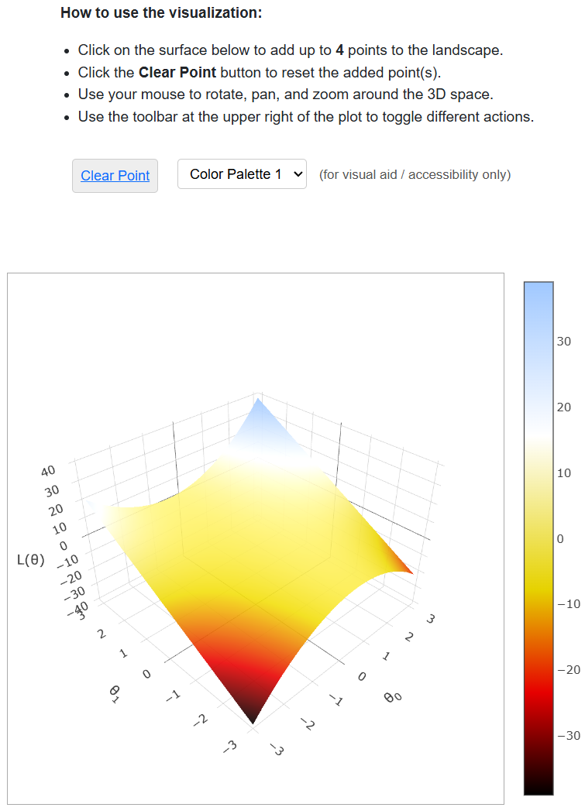

# PrairieLearn OER Element: Faded Parsons Problem

This element was developed by Nelson Lojo at UC Berkeley. Please carefully test the element and understand its features and limitations before deploying it in a course. It is provided as-is and not officially maintained by PrairieLearn, so we can only provide limited support for any issues you encounter!

If you like this element, you can use it in your own PrairieLearn course by copying the contents of the `elements` folder into your own course repository. After syncing, the element can be used as illustrated by the example question that is also contained in this repository.


## `pl-faded-parsons` element

This element creates a faded version of a Parsons Problem, where students drag and drop lines of code into order. In the faded version of the problem, students also fill in gaps in the code. 

To set up questions that the use the element...

An auto-grader for Faded Parsons Problems is also available...

### Example



```html
<pl-faded-parsons>
</pl-faded-parsons>
```

### Element Attributes

| Attribute | Type | Description |
|-----------|------|-------------|
| `answers-name` | string (required) | Unique name for the element. |


### Work around `pl-faded-parsons`

[Nathaniel Weinman, Armando Fox, and Marti A. Hearst. 2021. Improving Instruction of Programming Patterns with Faded Parsons Problems. In Proceedings of the 2021 CHI Conference on Human Factors in Computing Systems (CHI '21). Association for Computing Machinery, New York, NY, USA, Article 53, 1–4. https://doi.org/10.1145/3411764.3445228](https://dl.acm.org/doi/10.1145/3411764.3445228)

[Logan Caraco, Nate Weinman, Stanley Ko and Armando Fox. 2022. Automatically Converting Code-Writing Exercises to Variably-Scaffolded Parsons Problems. EECS Department University of California, Berkeley Technical Report No. UCB/EECS-2022-173. June 27, 2022. http://www2.eecs.berkeley.edu/Pubs/TechRpts/2022/EECS-2022-173.pdf](http://www2.eecs.berkeley.edu/Pubs/TechRpts/2022/EECS-2022-173.pdf)

[Nelson Lojo and Armando Fox. 2022. Teaching Test-Writing As a Variably-Scaffolded Programming Pattern. In Proceedings of the 27th ACM Conference on on Innovation and Technology in Computer Science Education Vol. 1 (ITiCSE '22). Association for Computing Machinery, New York, NY, USA, 498–504. https://doi.org/10.1145/3502718.3524789](https://dl.acm.org/doi/10.1145/3502718.3524789)

[Lauren Zhou, Akshit Dewan, Anirudh Kothapalli, Pamela Fox, Michael Ball, and Thomas Joseph. 2023. Implementing Faded Parsons Problems in a Very Large CS1 Course. In Proceedings of the 54th ACM Technical Symposium on Computer Science Education V. 2 (SIGCSE 2023). Association for Computing Machinery, New York, NY, USA, 1356. https://doi.org/10.1145/3545947.3576300](https://dl.acm.org/doi/abs/10.1145/3545947.3576300)

[Slide deck for a CS 194-244 project at University of California, Berkeley around problem autogeneration](https://docs.google.com/presentation/d/1XPSyo1BaQnEEaCSphn9YJi3tg7m5fiIwGa7qGVNdAzg/edit?usp=sharing)